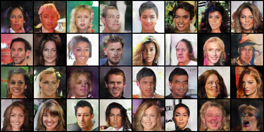

# NOTICE
This is the code I made a while ago. There will definitely be better code in other repositories. If you want to use conditional DCGAN now, I recommend looking for other good repositories. o(*￣▽￣*)o

# Conditional DCGAN implementation using pytorch with celebA dataset
## Reference
- Paper: 
    - Unsupervised Representation Learning with Deep Convolutional Generative Adversarial Networks [arxiv](https://arxiv.org/pdf/1511.06434.pdf)
    - Conditional Generative Adversarial Nets [arxiv](https://arxiv.org/pdf/1411.1784.pdf)
- Pytorch DCGAN Example: [github](https://github.com/pytorch/examples/tree/master/dcgan)
- CelebA Dataset: http://mmlab.ie.cuhk.edu.hk/projects/CelebA.html
    - We will use the img_align_celeba dataset.
## Usage
- python GAN.py --dataset_dir='dataset dir' --result_dir='result dir'
    - example: python GAN.py --dataset_dir=./celeba --result_dir=./celeba_result
- dataset example
    - ./celeba/celeba/000000.jpg
    - ./celeba/celeba/000001.jpg
    - ...
## Result

